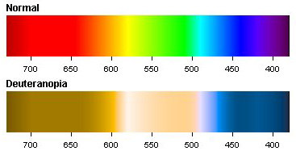

---
title       : Example formative assessment
subtitle    : Color-blindness
author      : James Suleiman
job         : Associate Professor, Management Information Systems
framework   : io2012        # {io2012, html5slides, shower, dzslides, ...}
highlighter : highlight.js  # {highlight.js, prettify, highlight}
hitheme     : tomorrow      # 
widgets     : [bootstrap, quiz]            # {mathjax, quiz, bootstrap}
mode        : selfcontained # {standalone, draft}
knit        : slidify::knit2slides
--- .class #id 

## Color Blindness

The most common forms of color blindness are the subtypes of red-green color blindness. If you want to learn about color blindness in more detail, consult [this free ebook](http://www.color-blindness.com/color-blind-essentials/). Duetan color vision deficiencies are the most common. Protan is less common, you can see the effects of both subtypes in the two sets of color spectrums below.

--- &radio

## Tableau Color Palettes

You have already worked with some of the color palettes in Tableau. Take this time to examine some of them. Out of the available palettes, which would be the the least color-blind friendly?

1. orange-blue diverging
2. _red-green diverging_
3. red-blue diverging
4. red-yellow diverging

*** .hint
Which palette doesn't have either of the two diverging color's present that are observable in the Duetan and Protan spectra on the prior slide?

*** .explanation
Red-green is the least color-blind friendly palette as both Duetan and Protan spectra do not contain either red or green. Orange-blue is actually the most color-blind friendly palette in Tableau but you may find there are some tradeoffs aesthetically.

